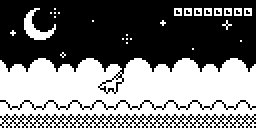

# Unicorn Dash

A tiny unicorn themed endless runner for the [Arduboy](https://www.arduboy.com)

# Screenshots

# Installation

Compile it from source code and upload it to your Arduboy using Arduino IDE or download an already precompiled [.hex](https://github.com/KirillKorolkov/unicorn-dash/releases/download/v0.9.5/unicorn_dash.hex) file

##### Dependencies

- [Arduboy2](https://github.com/MLXXXp/Arduboy2)
- [Arduboy-TinyFont](https://github.com/BotiKis/Arduboy-TinyFont)

# Note

You can also play this game in your [browser](https://tiberiusbrown.github.io/Ardens/player.html?blah=https://github.com/KirillKorolkov/unicorn-dash/releases/download/v0.9.5/unicorn_dash.hex&g=none&z=1&p=0&palette=highcontrast).

# License

Unicorn Dash is under [MIT license](./LICENSE)
